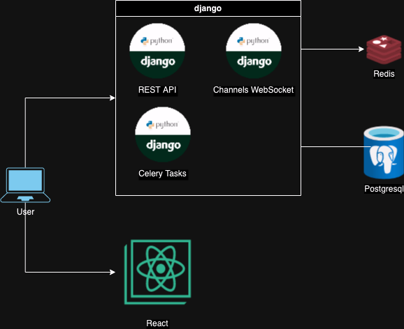
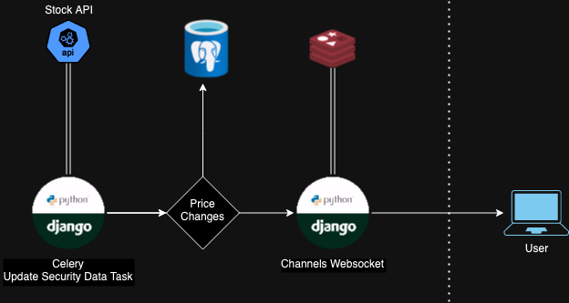

## This was a project was for a programming assessment

---

# Stock Tracker 

### Requirements 
- Build a stock watchlist service and client application that allows users to view their favorite stock prices.
- Users should be able to search for stocks by name or ticker and add them to a watchlist.
- Users should be able to remove a stock from their watchlist.
- Users should be able to see the current price of the stocks in their watchlist.
- Prices should update every 5 seconds.
- The service should be designed to support millions of users each with their own watchlist.
- User data should be persisted in a database and re-used when the app is restarted.
- The focus for this case study is on the service architecture and communication between the service and client application.
- The client application must support user login and a single screen that contains a search bar, list of stocks and current prices, but it does not need to be a polished UI.


This is my first time writing in Python & django so forgive me I am not following best practices

In order to support millions of users I went with an architecture that pushes out price changes using websockets. Users listen
through a websocket connection for the price changes in the stocks they are watching. This limits the number of interactions to 
initial connection + price changes. 



The channels package was used for handling websocket connections. When a user connects their stocks are looked up in the database
and they are added to a group channel that receives pricing updates for each of the stocks. Channels uses Redis on the backend
to store websocket connections and subscribed groups. 

Updating the internal Security data through the API is done through a scheduled background task using the Celery package.
This task runs at an interval so that we stay inbounds of the API limitations. There are two jobs that run, one for adding new Stocks, and
the other for price changes.




When the price change job runs it first reaches out to the stock api and fetches all the pricing data. It then compares the price from the 
API with the one from the database. If there is change it updates the price in the database and pushes a message with the price change
to Channels. Channels then does a broadcast to all users that are watching that stock


## APIs Added

`GET /security/?q=[Search]`
- Search for a stock by Ticker or Name
```
[
    {
        "id": 28,
        "name": "Salesforce",
        "ticker": "CRM",
        "last_price": 245.06
    }, ...
]
``` 

`POST /user/security/`
```
{"id":"[securityId]"}
```
- adds a security for the current user

`DELETE /user/security/`
```
{"id":"[securityId]"}
```
- removes a security for the current user

`WEBSOCKET /ws/watchlist/[userId]/`
- connects to a websocket and start receiving pricing updates
```
{"[ticker]":"[price]",...}
```

## Testing

`make test`

## Future Improvements

* Secure Login. Require password + TOTP for authentication and store authentication in JWT
* UI redesign
* Search backend like OpenSearch for looking up stocks
* Add redis caching for data model objects. For example when a user logs in check redis cache before looking in the database. 